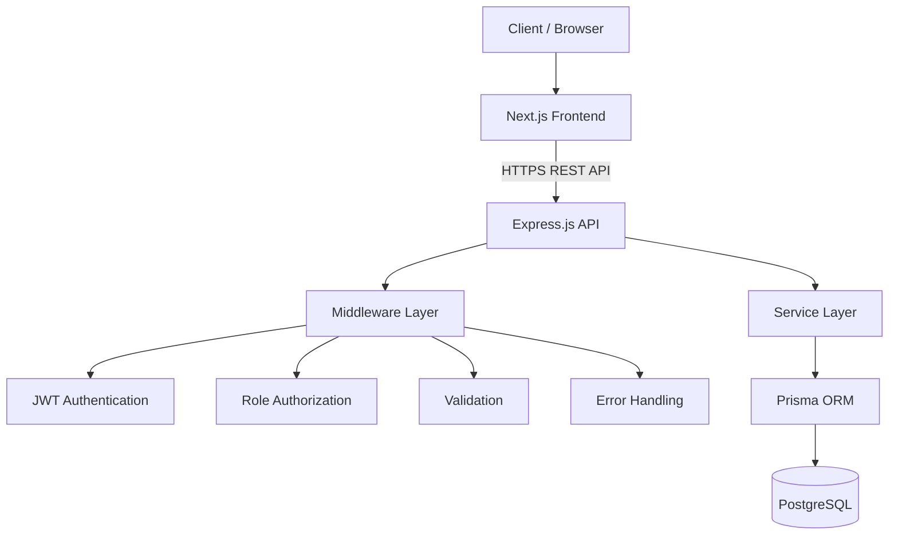
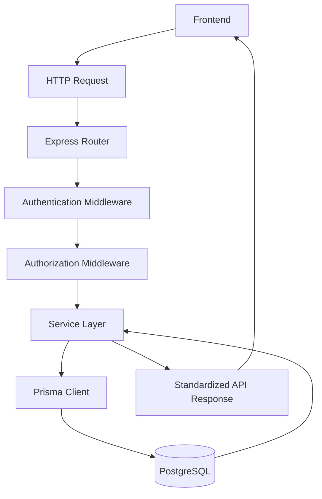
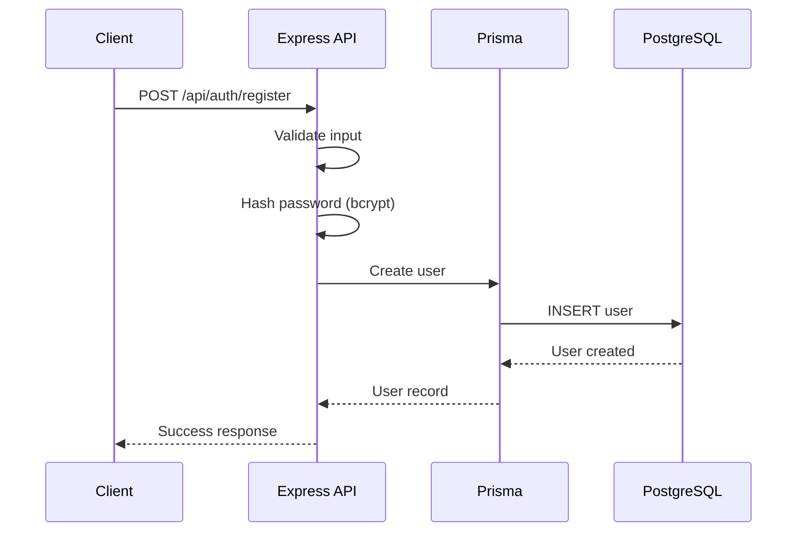
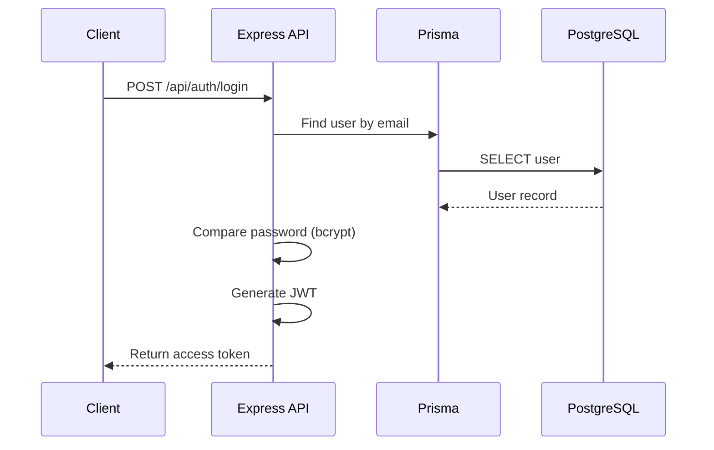
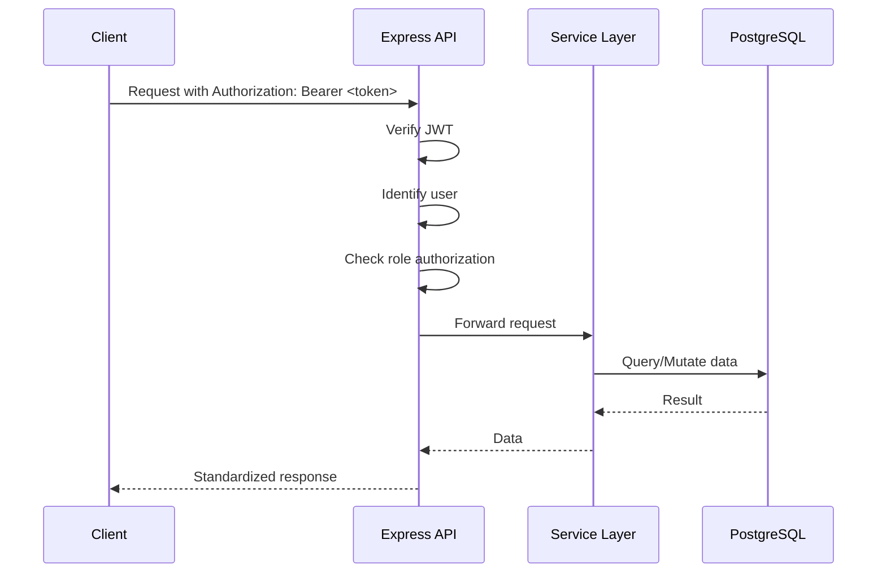
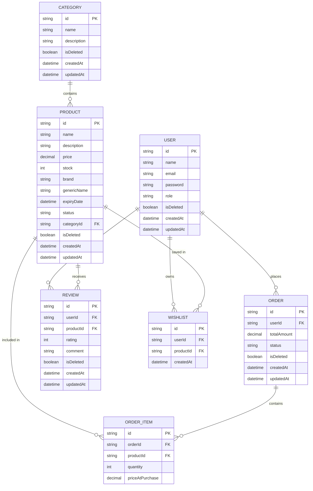
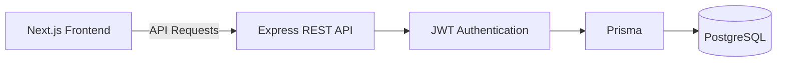
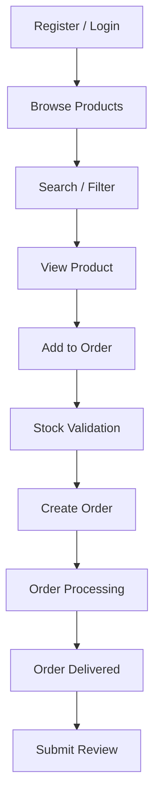
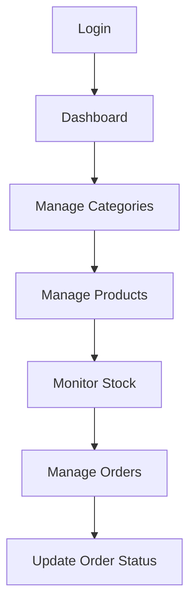
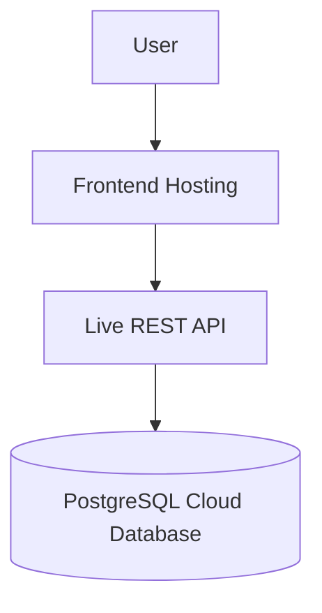

# OSUDHX — Smart Pharmacy Management System

**Client Repository:** [github.com/SyntaxAdil/osudhx](https://github.com/SyntaxAdil/osudhx) · **Server Repository:** [github.com/SyntaxAdil/osudhx-server](https://github.com/SyntaxAdil/osudhx-server) · **Live App:** [osudhx.vercel.app](https://osudhx.vercel.app)

A centralized platform for managing pharmacy users, medicine categories, products, customer orders, reviews, and wishlists — built as a full-stack TypeScript application with a modular, production-oriented backend architecture.

> **Note on project status:** OSUDHX is currently in the **planning / early development stage**. This README documents the **official system design and specification** — architecture, data model, API contracts, and workflows — as the source of truth for implementation. Sections that depend on a live codebase (deployment URLs, verified script names, test coverage) are explicitly marked as placeholders or **Planned** and will be updated once implemented.

---

## Table of Contents

1. [Project Description](#project-description)
2. [Key Features](#key-features)
3. [Tech Stack](#tech-stack)
4. [System Architecture](#system-architecture)
5. [Backend Architecture](#backend-architecture)
6. [Request Lifecycle](#request-lifecycle)
7. [Authentication Flow](#authentication-flow)
8. [Authorization Flow](#authorization-flow)
9. [Database Architecture](#database-architecture)
10. [ER Diagram](#er-diagram)
11. [Database Models](#database-models)
12. [API Documentation](#api-documentation)
13. [API Response Format](#api-response-format)
14. [HTTP Status Codes](#http-status-codes)
15. [Soft Delete Strategy](#soft-delete-strategy)
16. [Prisma Implementation](#prisma-implementation)
17. [Indexing Strategy](#indexing-strategy)
18. [Frontend Integration](#frontend-integration)
19. [Special Features](#special-features)
20. [Security](#security)
21. [Project Structure](#project-structure)
22. [Environment Variables](#environment-variables)
23. [Local Development Setup](#local-development-setup)
24. [Main User Workflow](#main-user-workflow)
25. [Admin / Pharmacist Workflow](#admin--pharmacist-workflow)
26. [Testing Strategy](#testing-strategy)
27. [Deployment](#deployment)
28. [Requirement Compliance](#requirement-compliance)
29. [Future Improvements](#future-improvements)
30. [License](#license)

---

## Project Description

**OSUDHX** is a smart pharmacy management system that provides a centralized platform for three types of users — **Customers**, **Pharmacists**, and **Admins** — to manage medicines, categories, orders, reviews, and wishlists through a clean REST API and a modern web frontend.

The system is designed around three core pillars:

- **Next.js frontend** — customer-facing storefront and role-based dashboards
- **Express.js REST API** — a modular, layered backend written in TypeScript
- **PostgreSQL** — a relational database accessed through Prisma ORM

The scope is intentionally focused on core pharmacy retail operations (users, categories, products, orders, reviews, wishlist) rather than an exhaustive healthcare platform. Features such as payment gateways, prescription OCR, AI diagnosis, delivery tracking, chat, supplier management, and medical records are explicitly **out of scope** for this project.

---

## Key Features

### Authentication
- User registration and login
- Password hashing with bcrypt
- JWT-based authentication
- Protected routes
- Role-based authorization

### User Management
- Create, list, retrieve, update, and soft-delete users
- Roles: `ADMIN`, `PHARMACIST`, `CUSTOMER`

### Category Management
- Full CRUD for medicine categories
- Soft delete support

### Medicine / Product Management
- Product fields: name, description, price, stock, brand, generic name, expiry date, status, category relation, timestamps
- Create, list, retrieve, update, and soft-delete products
- Search products
- Filter products by category
- Basic stock management

### Order Management
- Multi-item orders per customer
- Product price snapshot per order item
- Order status lifecycle: `PENDING → CONFIRMED → PROCESSING → DELIVERED` (or `CANCELLED`)
- Retrieve orders (all / by ID / by customer)
- Update order status
- Soft delete

### Review Management
- Customers can review purchased products (rating + comment)
- Full CRUD scoped to review ownership
- Soft delete

### Wishlist
- Add / view / remove wishlist items per customer

---

## Tech Stack

**Backend**
| Technology | Purpose |
|---|---|
| Node.js | Runtime environment |
| Express.js | REST API framework |
| TypeScript | Static typing across the backend |
| Prisma ORM | Type-safe database access layer |
| PostgreSQL | Relational database |
| JWT | Stateless authentication tokens |
| bcrypt | Password hashing |
| dotenv | Environment configuration |
| CORS | Cross-origin request handling |

**Frontend**
| Technology | Purpose |
|---|---|
| Next.js | React framework (SSR/CSR hybrid) |
| React | UI library |
| TypeScript | Static typing across the frontend |
| Tailwind CSS | Utility-first styling |

**Development / Tooling**
| Tool | Purpose |
|---|---|
| Git & GitHub | Version control |
| Postman | API testing and documentation |
| Prisma Studio | Visual database browser |

**Deployment**
```text
Frontend Repository: https://github.com/SyntaxAdil/osudhx
Backend Repository:  https://github.com/SyntaxAdil/osudhx-server
Frontend URL:         https://osudhx.vercel.app
Backend URL:           [Live Backend URL]
```

---

## System Architecture



The frontend never talks to the database directly. All data access is mediated by the Express API, which enforces authentication, authorization, and validation before any request reaches the service layer or the database.

---

## Backend Architecture

The backend follows a **layered, modular architecture** to keep concerns separated and the codebase maintainable as it grows.

```text
server/
├── prisma/
│   └── schema.prisma        # Data model, enums, relations
│
├── src/
│   ├── app.ts                # Express app configuration
│   ├── server.ts              # Server bootstrap / entry point
│   │
│   ├── routes/                # Route definitions per resource
│   │
│   ├── services/               # Business logic, grouped by domain
│   │   ├── user/
│   │   ├── category/
│   │   ├── product/
│   │   ├── order/
│   │   ├── review/
│   │   └── wishlist/
│   │
│   ├── middleware/             # Auth, role guard, error handler, validation
│   ├── lib/                    # Shared clients (e.g. Prisma client instance)
│   └── utils/                  # Helpers (response formatting, hashing, etc.)
│
├── .env
├── package.json
└── tsconfig.json
```

**Design principles:**

- **Separation of concerns** — routes only wire endpoints to controllers/services; business logic lives in the service layer, never in route handlers.
- **Modular architecture** — each domain (user, product, order, review, wishlist) owns its own service module, making the system easy to extend without cross-module coupling.
- **Type safety** — TypeScript end-to-end, including Prisma-generated types, reduces runtime data errors.
- **Maintainability & scalability** — new domains can be added as new service modules without touching existing ones.
- **Reusability** — shared logic (response formatting, error classes, auth helpers) lives in `lib/` and `utils/`.
- **Centralized error handling** — a single Express error-handling middleware normalizes all error responses.

---

## Request Lifecycle



| Stage | Responsibility |
|---|---|
| Express Router | Matches the URL/method to a handler |
| Authentication Middleware | Verifies the JWT and identifies the requesting user |
| Authorization Middleware | Confirms the user's role is permitted for this action |
| Service Layer | Executes business logic and orchestrates data access |
| Prisma Client | Executes type-safe, parameterized queries |
| PostgreSQL | Persists and returns data |
| Standardized Response | Wraps the result in the common success/error envelope |

---

## Authentication Flow

### Registration



### Login



### Protected Request



---

## Authorization Flow

Authorization is enforced **after** authentication, via a role-guard middleware that checks the authenticated user's role against the roles permitted for a given route.

```text
Authenticated Request
        ↓
Extract user role from JWT payload
        ↓
Compare against route's allowed roles
        ↓
   Allowed?
   /      \
 Yes       No
  ↓          ↓
Proceed   403 Forbidden
```

**Role capabilities (by design):**

| Action | Customer | Pharmacist | Admin |
|---|---|---|---|
| Manage own profile | ✅ | ✅ | ✅ |
| Manage all users | ❌ | ❌ | ✅ |
| Manage categories | ❌ | ✅ | ✅ |
| Manage products / stock | ❌ | ✅ | ✅ |
| Place orders | ✅ | ❌ | ❌ |
| Update order status | ❌ | ✅ | ✅ |
| Write reviews | ✅ | ❌ | ❌ |
| Manage own wishlist | ✅ | ❌ | ❌ |

---

## Database Architecture

PostgreSQL is accessed exclusively through Prisma ORM, which generates a fully typed client from `schema.prisma`. All relational integrity (foreign keys, cardinality) is defined at the schema level.

## ER Diagram



---

## Database Models

### User
Represents an account in the system, with a role of `ADMIN`, `PHARMACIST`, or `CUSTOMER`. Has many `Order`, `Review`, and `Wishlist` records.

### Category
Groups products for browsing and filtering. Has many `Product` records.

### Product
Represents a medicine/item for sale. Belongs to a `Category`; has many `OrderItem`, `Review`, and `Wishlist` records. Carries stock, pricing, and status (`ACTIVE` / `INACTIVE`).

### Order
Represents a customer purchase. Belongs to a `User`; has many `OrderItem` records; tracks an overall `status` and `totalAmount`.

### OrderItem
A line item within an `Order`. Belongs to both an `Order` and a `Product`; stores `quantity` and a **price snapshot** (`priceAtPurchase`) independent of the product's current price.

### Review
A customer's rating/comment on a `Product`. Belongs to a `User` and a `Product`.

### Wishlist
A saved-for-later relationship between a `User` and a `Product`.

### Relationships Summary

| Model | Relationship |
|---|---|
| User | has many Order, Review, Wishlist |
| Category | has many Product |
| Product | belongs to Category; has many OrderItem, Review, Wishlist |
| Order | belongs to User; has many OrderItem |
| OrderItem | belongs to Order; belongs to Product |
| Review | belongs to User; belongs to Product |
| Wishlist | belongs to User; belongs to Product |

---

## Enums

```text
UserRole
  ADMIN
  PHARMACIST
  CUSTOMER

ProductStatus
  ACTIVE
  INACTIVE

OrderStatus
  PENDING
  CONFIRMED
  PROCESSING
  DELIVERED
  CANCELLED
```

Enums are used instead of free-text strings for role, status, and state fields because they:

- Enforce a fixed, valid set of values at the database level
- Prevent typos and inconsistent state values (e.g. `"pending"` vs `"Pending"`)
- Make status-based queries and business logic (e.g. state machines for order status) predictable and type-safe
- Are self-documenting in the schema

---

## API Documentation

All endpoints are prefixed with `/api`. Endpoints marked **Auth** require a valid `Authorization: Bearer <token>` header. Endpoints marked with a **Role** restrict access to that role (or `ADMIN`, which is assumed to have superset access where applicable).

### Authentication

| Method | Endpoint | Purpose | Auth | Role |
|---|---|---|---|---|
| POST | `/api/auth/register` | Register a new user | No | — |
| POST | `/api/auth/login` | Authenticate and receive a JWT | No | — |

**POST `/api/auth/register`**
- Request body: `{ name, email, password, role? }`
- Success: `201 Created`
- Errors: `400` (validation), `409` (email already exists)

**POST `/api/auth/login`**
- Request body: `{ email, password }`
- Success: `200 OK` with `{ token, user }`
- Errors: `400` (validation), `401` (invalid credentials)

### Users

| Method | Endpoint | Purpose | Auth | Role |
|---|---|---|---|---|
| POST | `/api/users` | Create a user | Yes | Admin |
| GET | `/api/users` | List users | Yes | Admin |
| GET | `/api/users/:id` | Get user by ID | Yes | Admin / Self |
| PATCH | `/api/users/:id` | Update user | Yes | Admin / Self |
| DELETE | `/api/users/:id` | Soft delete user | Yes | Admin |

- Success responses: `200 OK` / `201 Created`
- Common errors: `401 Unauthorized`, `403 Forbidden`, `404 Not Found`, `422 Unprocessable Entity`

### Categories

| Method | Endpoint | Purpose | Auth | Role |
|---|---|---|---|---|
| POST | `/api/categories` | Create category | Yes | Pharmacist / Admin |
| GET | `/api/categories` | List categories | No | — |
| GET | `/api/categories/:id` | Get category by ID | No | — |
| PATCH | `/api/categories/:id` | Update category | Yes | Pharmacist / Admin |
| DELETE | `/api/categories/:id` | Soft delete category | Yes | Pharmacist / Admin |

### Products

| Method | Endpoint | Purpose | Auth | Role |
|---|---|---|---|---|
| POST | `/api/products` | Create product | Yes | Pharmacist / Admin |
| GET | `/api/products` | List products (supports `?search=` and `?categoryId=`) | No | — |
| GET | `/api/products/:id` | Get product by ID | No | — |
| PATCH | `/api/products/:id` | Update product | Yes | Pharmacist / Admin |
| DELETE | `/api/products/:id` | Soft delete product | Yes | Pharmacist / Admin |

- Query parameters: `search` (name match), `categoryId` (filter), pagination parameters as needed
- Common errors: `400`, `401`, `403`, `404`, `422`

### Orders

| Method | Endpoint | Purpose | Auth | Role |
|---|---|---|---|---|
| POST | `/api/orders` | Create order | Yes | Customer |
| GET | `/api/orders` | List orders | Yes | Admin / Pharmacist |
| GET | `/api/orders/:id` | Get order by ID | Yes | Owner / Admin / Pharmacist |
| GET | `/api/orders/customer/:customerId` | Get a customer's orders | Yes | Owner / Admin |
| PATCH | `/api/orders/:id` | Update order status | Yes | Pharmacist / Admin |
| DELETE | `/api/orders/:id` | Soft delete order | Yes | Admin |

- Order creation validates stock availability per item before committing (see [Special Features](#special-features))
- Common errors: `400`, `401`, `403`, `404`, `409` (insufficient stock)

### Reviews

| Method | Endpoint | Purpose | Auth | Role |
|---|---|---|---|---|
| POST | `/api/reviews` | Create review | Yes | Customer |
| GET | `/api/reviews` | List reviews (supports `?productId=`) | No | — |
| GET | `/api/reviews/:id` | Get review by ID | No | — |
| PATCH | `/api/reviews/:id` | Update review | Yes | Owner / Admin |
| DELETE | `/api/reviews/:id` | Soft delete review | Yes | Owner / Admin |

### Wishlist

| Method | Endpoint | Purpose | Auth | Role |
|---|---|---|---|---|
| POST | `/api/wishlist` | Add product to wishlist | Yes | Customer |
| GET | `/api/wishlist` | View own wishlist | Yes | Customer |
| DELETE | `/api/wishlist/:id` | Remove item from wishlist | Yes | Owner |

---

## API Response Format

All API responses follow a consistent envelope so the frontend can rely on a single parsing strategy.

**Success**
```json
{
  "success": true,
  "message": "Product retrieved successfully",
  "data": {}
}
```

**Error**
```json
{
  "success": false,
  "message": "Product not found",
  "error": {}
}
```

A consistent response shape means the frontend can implement a single API client wrapper (success/error handling, toasts, redirects) instead of writing custom parsing logic per endpoint — reducing integration bugs and boilerplate.

---

## HTTP Status Codes

| Code | Meaning | Typical Use |
|---|---|---|
| 200 | OK | Successful GET/PATCH/DELETE |
| 201 | Created | Successful POST (resource created) |
| 400 | Bad Request | Malformed request body/params |
| 401 | Unauthorized | Missing/invalid JWT |
| 403 | Forbidden | Valid JWT, insufficient role/permission |
| 404 | Not Found | Resource does not exist (or is soft-deleted) |
| 409 | Conflict | Duplicate resource (e.g. email), insufficient stock |
| 422 | Unprocessable Entity | Valid JSON, failed validation rules |
| 500 | Internal Server Error | Unhandled server-side failure |

---

## Soft Delete Strategy

Instead of permanently removing records, deletable models use an `isDeleted` boolean flag.

```text
DELETE request
      ↓
isDeleted = true
      ↓
Record remains in database
      ↓
Normal queries exclude deleted records
```

This approach is used because it:

- Preserves historical data for **auditability** (e.g. past orders referencing a since-"deleted" product)
- Allows **data recovery** without backups if a delete was accidental
- Avoids breaking foreign-key relationships that other records (orders, reviews) still depend on

---

## Prisma Implementation

Prisma is used as the sole database access layer.

**Used features:**
- **Prisma Client** — type-safe query builder generated from the schema
- **Prisma Schema** — single source of truth for models, enums, and relations
- **Prisma Migrate** — versioned schema migrations
- **Prisma Studio** — visual data browser for local development
- **Relations & Enums** — modeled natively in `schema.prisma`
- **Indexes** — declared on frequently queried fields (see below)
- **Transactions** — used where multi-step writes must be atomic (e.g. creating an order and decrementing stock together)

**Common commands:**
```bash
npx prisma generate     # Generate the Prisma Client
npx prisma migrate dev  # Apply schema changes locally
npx prisma studio       # Open the visual database browser
npx prisma format       # Format schema.prisma
```

---

## Indexing Strategy

Recommended indexes include:

- `User.email` — unique lookups during login/registration
- `Product.name` — search queries
- `Product.categoryId` — category filtering
- `Product.status` — filtering active/inactive products
- `Order.userId` — retrieving a customer's orders
- `Order.status` — filtering/reporting by order status
- `Review.productId` — retrieving reviews for a product

These indexes target the query patterns defined in the API layer above (search, filter, and per-user/per-product lookups). Actual index definitions live in `schema.prisma` and should be verified against the implemented file as the project progresses.

---

## Frontend Integration



The Next.js frontend consumes the backend REST API for:

- Authentication (register/login, token storage)
- Product browsing, search, and category filtering
- Order creation and order history
- Product reviews
- Wishlist management
- Role-based dashboards (Admin/Pharmacist product & order management, Customer account & orders)

The frontend holds no direct database access — every data operation is routed through the authenticated REST API described above.

---

## Special Features

### 1. Role-Based Access Control
Admin, Pharmacist, and Customer roles have distinct permissions enforced at the middleware layer, keeping authorization logic out of individual route handlers.

### 2. Product Search & Category Filtering
Customers can search medicines by name and filter listings by category, supported by dedicated database indexes.

### 3. Stock-Aware Ordering
Orders validate stock availability before creation:

```text
Order Created
    ↓
Check Product Stock
    ↓
Enough Stock?
   /       \
 Yes       No
  ↓          ↓
Create     Reject
Order      Request
  ↓
Decrease Stock
```

### 4. Product Price Snapshot
When an order is placed, the product's current price is copied into `OrderItem.priceAtPurchase`. This ensures that if a product's price changes later, historical orders retain the price the customer actually paid.

### 5. Review Ownership
A customer may only update or delete their own review. Admins may moderate (update/delete) any review.

---

## Security

- **Password hashing** — all passwords are hashed with bcrypt before storage; plaintext passwords are never persisted or logged
- **JWT authentication** — stateless, signed tokens for session management
- **Protected routes** — authentication middleware guards all non-public endpoints
- **Role-based authorization** — a role-guard middleware restricts sensitive operations to permitted roles
- **Environment variables** — secrets (DB credentials, JWT secret) are loaded via `.env` and never committed
- **CORS configuration** — restricts which origins may call the API
- **Input validation** — request bodies are validated before reaching the service layer
- **No password exposure** — password fields are excluded from all API responses
- **Consistent HTTP status codes** — predictable error semantics for the frontend and API consumers
- **Secure database access** — all queries go through Prisma's parameterized query builder, avoiding raw SQL injection risks

---

## Project Structure

> Example structure per the system design — actual structure will be confirmed once the repository is initialized.

```text
osudhx/  (monorepo view — client + server may also live in separate repositories)
│
├── client/
│   ├── app/
│   ├── components/
│   ├── services/
│   └── ...
│
├── server/
│   ├── prisma/
│   │   └── schema.prisma
│   ├── src/
│   │   ├── routes/
│   │   ├── services/
│   │   │   ├── user/
│   │   │   ├── category/
│   │   │   ├── product/
│   │   │   ├── order/
│   │   │   ├── review/
│   │   │   └── wishlist/
│   │   ├── middleware/
│   │   ├── lib/
│   │   ├── utils/
│   │   ├── app.ts
│   │   └── server.ts
│   ├── .env
│   ├── package.json
│   └── tsconfig.json
│
└── README.md
```

---

## Environment Variables

```env
DATABASE_URL="your_database_url"
JWT_SECRET="your_jwt_secret"
PORT=5000
CLIENT_URL="your_frontend_url"
```

> Real secrets must **never** be committed to GitHub. Use `.env` locally and configure environment variables through your hosting provider's secret management in production.

---

## Local Development Setup

### 1. Clone the repository
```bash
git clone https://github.com/SyntaxAdil/osudhx-server.git
cd osudhx-server
```

### 2. Install dependencies
```bash
npm install
```

### 3. Configure environment variables
Create a `.env` file in the `server/` directory using the template in [Environment Variables](#environment-variables).

### 4. Set up the database
```bash
npx prisma generate
npx prisma migrate dev
```

### 5. Start the development server
```bash
npm run dev
```
> Use the project's actual `package.json` script name once defined — `npm run dev` is the conventional placeholder.

---

## Main User Workflow



---

## Admin / Pharmacist Workflow



---

## Testing Strategy

API testing is performed manually/collection-based using **Postman**, covering:

- Authentication (register/login, invalid credentials, duplicate email)
- CRUD operations across all resources (Users, Categories, Products, Orders, Reviews, Wishlist)
- Validation rules (missing/invalid fields)
- Authorization rules (role-restricted endpoints, ownership checks)
- Error response shape and status codes
- Stock validation during order creation

> Automated test suites are not yet part of the project and are listed under [Future Improvements](#future-improvements) if/when introduced.

---

## Deployment

```text
Frontend: https://osudhx.vercel.app
Backend:  [Live Backend URL]
Repositories:
  Frontend: https://github.com/SyntaxAdil/osudhx
  Backend:  https://github.com/SyntaxAdil/osudhx-server
```

**Deployment architecture:**



Specific hosting providers are intentionally left unspecified until a deployment decision is made.

---

## Requirement Compliance

| Requirement | Status |
|---|---|
| Express.js | Planned |
| TypeScript | Planned |
| Prisma ORM | Planned |
| PostgreSQL | Planned |
| JWT Authentication | Planned |
| bcrypt | Planned |
| CORS | Planned |
| Minimum 4 services (User, Category, Product, Order, Review, Wishlist) | Planned |
| Minimum 2 enums (UserRole, ProductStatus, OrderStatus) | Planned |
| Relations (User–Order–Review–Wishlist, Category–Product, Order–OrderItem–Product) | Planned |
| Soft Delete | Planned |
| Timestamps | Planned |
| CRUD APIs | Planned |
| Prisma Migrate | Planned |
| Prisma Studio | Planned |
| Indexes | Planned |
| API Documentation | ✅ (this document) |
| Frontend Integration | Planned |

> All items are marked **Planned** because they describe the intended implementation and no codebase has been built yet. This table should be updated to ✅ per item as each is actually implemented and verified against the repository.

---

## Future Improvements

The following are explicitly **out of current scope** and listed only as potential future directions:

- Payment gateway integration
- Prescription management
- Advanced inventory analytics
- Notification system
- Delivery tracking

---

## License

This project is licensed under the [MIT License](LICENSE).