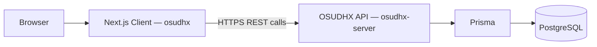
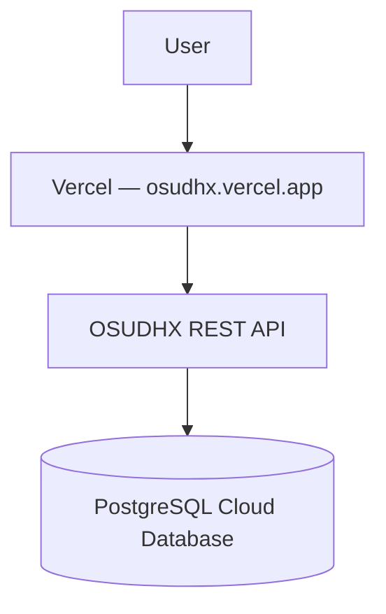

# OSUDHX — Client (Frontend)

**Repository:** [github.com/SyntaxAdil/osudhx](https://github.com/SyntaxAdil/osudhx)
**Live App:** [osudhx.vercel.app](https://osudhx.vercel.app)
**Backend API Repository:** [github.com/SyntaxAdil/osudhx/server](https://github.com/SyntaxAdil/osudhx-server)
**API Reference:** see `API_DOCUMENTATION.md` / `api-docs.html` in the server repository

This is the **frontend client** for OSUDHX — Smart Pharmacy Management System. It is a Next.js application that provides the customer storefront and the role-based Admin/Pharmacist dashboards, consuming the OSUDHX REST API for all data.

> **Project status:** This client is in the **planning / early development stage**, built against the OSUDHX API specification. Sections describing implementation details (scripts, exact routes) should be verified against the codebase as it is built out; deployment details are placeholders until the app is live.

---

## Table of Contents

1. [Overview](#overview)
2. [Tech Stack](#tech-stack)
3. [Application Architecture](#application-architecture)
4. [Key Features by Role](#key-features-by-role)
5. [Project Structure](#project-structure)
6. [Routing Overview](#routing-overview)
7. [API Integration](#api-integration)
8. [Authentication in the Client](#authentication-in-the-client)
9. [Environment Variables](#environment-variables)
10. [Local Development Setup](#local-development-setup)
11. [Styling](#styling)
12. [Deployment](#deployment)
13. [Requirement Compliance](#requirement-compliance)
14. [Related Repositories](#related-repositories)
15. [License](#license)

---

## Overview

The OSUDHX client is a **Next.js (App Router) + TypeScript** application styled with **Tailwind CSS**. It talks exclusively to the OSUDHX backend REST API — it holds no direct database access and no business logic beyond presentation, form handling, and client-side state.

The client serves three experiences from one codebase:

- **Public storefront** — browse and search medicines, view categories, read reviews (no login required)
- **Customer dashboard** — account, orders, order history, wishlist, submitting reviews
- **Admin / Pharmacist dashboard** — manage categories, products/stock, and order statuses

---

## Tech Stack

| Layer | Technology |
|---|---|
| Framework | Next.js |
| Language | TypeScript |
| UI library | React |
| Styling | Tailwind CSS |
| HTTP client | Fetch API / a thin API client wrapper (see [API Integration](#api-integration)) |
| Auth token storage | HTTP-only cookie or client-side storage, set at login (see [Authentication](#authentication-in-the-client)) |
| Hosting | Vercel |

---

## Application Architecture



The client renders pages (server components where data can be fetched at request time, client components for interactive forms/dashboards) and calls the backend's versioned REST endpoints for every read/write operation. See the backend's `API_DOCUMENTATION.md` for the full endpoint contract.

---

## Key Features by Role

### Public / Guest
- Browse and search medicines
- Filter by category
- View product detail pages, including reviews

### Customer (authenticated)
- Register / log in
- Manage own profile
- Add products to cart/order, checkout (stock-validated)
- View order history and order status
- Submit, edit, and delete own product reviews
- Manage wishlist

### Pharmacist (authenticated)
- Manage categories
- Manage products and stock levels
- View and update order statuses

### Admin (authenticated)
- Full access to Pharmacist capabilities
- Manage all user accounts

---

## Project Structure

> Reflects the intended Next.js App Router layout per the project specification.

```text
osudhx/
├── app/
│   ├── (public)/
│   │   ├── page.tsx                 # Home / storefront
│   │   ├── products/
│   │   │   ├── page.tsx             # Product listing + search + filter
│   │   │   └── [id]/page.tsx        # Product detail + reviews
│   │   └── categories/
│   │       └── [id]/page.tsx
│   │
│   ├── (auth)/
│   │   ├── login/page.tsx
│   │   └── register/page.tsx
│   │
│   ├── (customer)/
│   │   ├── account/page.tsx
│   │   ├── orders/page.tsx
│   │   ├── orders/[id]/page.tsx
│   │   └── wishlist/page.tsx
│   │
│   ├── (dashboard)/                  # Pharmacist / Admin
│   │   ├── dashboard/page.tsx
│   │   ├── categories/page.tsx
│   │   ├── products/page.tsx
│   │   ├── orders/page.tsx
│   │   └── users/page.tsx            # Admin only
│   │
│   ├── layout.tsx
│   └── globals.css
│
├── components/
│   ├── ui/                           # Buttons, inputs, cards, tables
│   ├── product/
│   ├── order/
│   ├── review/
│   └── layout/                       # Navbar, sidebar, footer
│
├── services/                          # API client functions, grouped by domain
│   ├── auth.ts
│   ├── users.ts
│   ├── categories.ts
│   ├── products.ts
│   ├── orders.ts
│   ├── reviews.ts
│   └── wishlist.ts
│
├── lib/
│   ├── apiClient.ts                   # Base fetch wrapper (auth header, error handling)
│   └── auth.ts                        # Token read/write helpers, role guards
│
├── types/                              # Shared TypeScript types mirroring API models
├── .env.local
├── next.config.js
├── tailwind.config.ts
├── package.json
└── tsconfig.json
```

---

## Routing Overview

| Route group | Access | Purpose |
|---|---|---|
| `/`, `/products`, `/products/[id]`, `/categories/[id]` | Public | Storefront browsing |
| `/login`, `/register` | Public | Auth |
| `/account`, `/orders`, `/orders/[id]`, `/wishlist` | Customer | Self-service account area |
| `/dashboard`, `/dashboard/categories`, `/dashboard/products`, `/dashboard/orders` | Pharmacist, Admin | Operational management |
| `/dashboard/users` | Admin only | User management |

Route access is enforced client-side (redirect if unauthenticated/unauthorized) **and** relies on the backend's own authentication/authorization middleware as the source of truth — the client never trusts its own role check alone for data access.

---

## API Integration

All data access goes through a single API client wrapper so response parsing and error handling stay consistent across the app.

```ts
// lib/apiClient.ts (concept)
async function apiClient<T>(path: string, options?: RequestInit): Promise<T> {
  const res = await fetch(`${process.env.NEXT_PUBLIC_API_URL}${path}`, {
    ...options,
    headers: {
      "Content-Type": "application/json",
      ...(getToken() ? { Authorization: `Bearer ${getToken()}` } : {}),
      ...options?.headers,
    },
  });

  const json = await res.json();

  if (!json.success) {
    throw new Error(json.message || "Request failed");
  }

  return json.data as T;
}
```

Domain-specific service files (`services/products.ts`, `services/orders.ts`, etc.) wrap this client with typed functions like `getProducts()`, `createOrder()`, `getWishlist()` — mirroring the endpoints documented in the backend's API reference.

---

## Authentication in the Client

```text
Login form submit
      ↓
POST /api/auth/login  (via services/auth.ts)
      ↓
Store JWT (cookie or client storage)
      ↓
Attach "Authorization: Bearer <token>" on every subsequent request
      ↓
Route guards read role from decoded token / session to show or hide
Customer vs Pharmacist/Admin navigation and pages
```

The client does not implement its own authentication logic beyond storing and attaching the token — password hashing, token issuance, and verification are entirely owned by the backend.

---

## Environment Variables

```env
NEXT_PUBLIC_API_URL="http://localhost:5000/api"
```

| Variable | Purpose |
|---|---|
| `NEXT_PUBLIC_API_URL` | Base URL of the OSUDHX backend API the client calls |

> In production (Vercel), `NEXT_PUBLIC_API_URL` points to the deployed backend's live URL. Never commit real environment values to GitHub.

---

## Local Development Setup

### 1. Clone the repository
```bash
git clone https://github.com/SyntaxAdil/osudhx.git
cd osudhx
```

### 2. Install dependencies
```bash
npm install
```

### 3. Configure environment variables
Create `.env.local` using the template in [Environment Variables](#environment-variables), pointing to a running instance of `osudhx-server`.

### 4. Start the development server
```bash
npm run dev
```

The app runs at `http://localhost:3000` by default.

> Ensure the backend (`osudhx-server`) is running locally, or point `NEXT_PUBLIC_API_URL` at a deployed instance, before testing authenticated flows.

---

## Styling

Tailwind CSS is used for all styling, with shared primitives (buttons, inputs, cards, tables) centralized under `components/ui/` to keep the storefront and dashboard visually consistent. No CSS-in-JS or additional UI framework is introduced beyond Tailwind, keeping the styling layer lightweight and predictable.

---

## Deployment

```text
Live App: https://osudhx.vercel.app
Hosting:  Vercel
Backend:  [Live Backend URL]
```



The client is deployed independently of the backend; `NEXT_PUBLIC_API_URL` is configured per-environment (Preview vs Production) in Vercel's project settings.

---

## Requirement Compliance

| Requirement | Status |
|---|---|
| Next.js (App Router) | Planned |
| TypeScript | Planned |
| Tailwind CSS | Planned |
| Role-based routing (Customer / Pharmacist / Admin) | Planned |
| API integration layer (typed service functions) | Planned |
| JWT-based auth handling | Planned |
| Product search & category filtering UI | Planned |
| Stock-aware checkout flow | Planned |
| Review & wishlist UI | Planned |
| Vercel deployment | Planned |

> Marked **Planned** because the client is in the specification stage. Update per item as each is implemented and verified in the repository.

---

## Related Repositories

| Repo | Purpose |
|---|---|
| [`osudhx`](https://github.com/SyntaxAdil/osudhx/client) | This repository — Next.js frontend client |
| [`osudhx-server`](https://github.com/SyntaxAdil/osudhx/server) | Express + Prisma + PostgreSQL REST API |

---

## License

This project is licensed under the [MIT License](LICENSE).